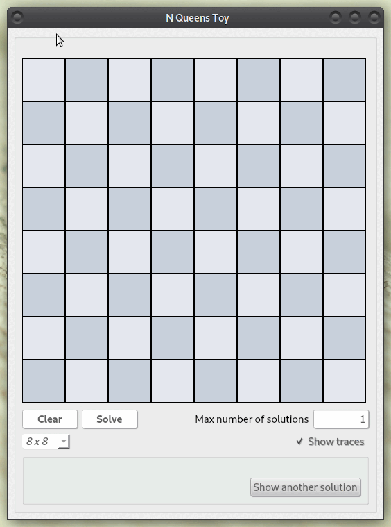

# ECV - Sudoku

**:star2: Exact cover problem - N Queens application :star2:**

Graphic toy written in C++/Qt to solve the [**N Queens problem**](https://en.wikipedia.org/wiki/Eight_queens_puzzle).

Under the hood, it uses the [**ECV library**](https://github.com/MericLuc/ecv) that implements [Donald Knuth's Algorithm X](https://arxiv.org/pdf/cs/0011047v1.pdf). 



## How to build/install

_Dependencies_ : 
  - Qt5 (Qt5::Widgets package)
  - ecv (as a submodule)

Start by getting the sources :

```
[~/git] git clone https://github.com/MericLuc/ecv-queens.git
[~/git] git submodule update --init --recursive
```

Then, the easiest way to build is to use it as a QtCreator project.

Otherwise, you can build from command-line using cmake and defining a bunch of Qt related variables.

It should be something like that (not garanteed) : 

```
[~/builds] cmake -S ${PATH_TO_PROJECT} -B ${PATH_TO_BUILD} -DCMAKE_BUILD_TYPE=Release -DCMAKE_PREFIX_PATH=${PATH_TO_QT_INSTALL}
[~/builds] make
```

## Example usage

[**Play**](https://mericluc.github.io/ecv/queens/app.html) in your browser using a [webassembly](https://webassembly.org/) compiled version.

_Rules_ : 
  - Hover a cell to select it.
  - Left-click to add a queen to a cell.
  - Right-click to remove a queen from a cell.
  - For the rest, I think the UI buttons are self-explanatory 😁

## Acknowledgements

[This article](https://www.nohuddleoffense.de/2019/01/20/dancing-links-algorithm-x-and-the-n-queens-puzzle/) was pretty useful, especially to realize the concept of "primary/secondary" constraints in exact-cover problems.